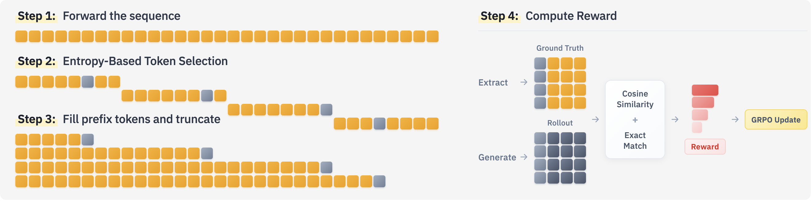
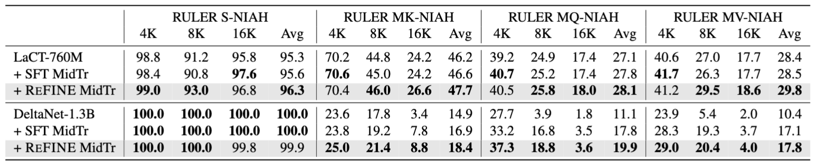
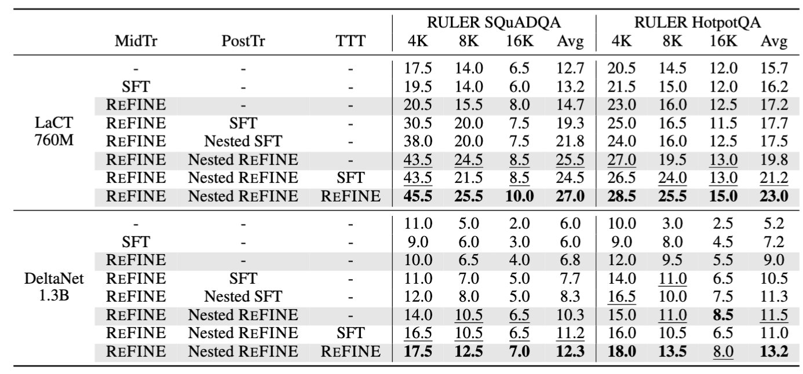
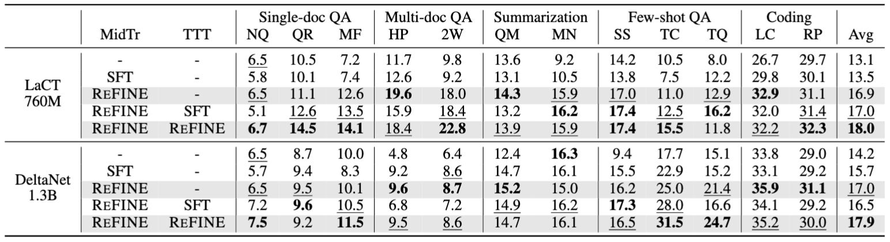

# ReFINE: Reinforced Fast Weights with Next Sequence Prediction

This repository contains the official implementation of **ReFINE**, introduced in the paper:

> **Reinforced Fast Weights with Next Sequence Prediction**  
> Hee Seung Hwang*, Xindi Wu*, Sanghyuk Chun, Olga Russakovsky  


---

## 🔍 Overview

Fast weight architectures (e.g., LaCT, DeltaNet, GatedDeltaNet) are typically pre-trained with **next-token prediction (NTP)**, which provides only token-level supervision. **ReFINE** addresses this limitation by optimizing for **Next-Sequence Prediction (NSP)** via reinforcement learning. 

ReFINE is **phase-agnostic** and can be applied during:
- **Mid-training** - Training on long-context corpora
- **Post-training** - Task-specific fine-tuning
- **Test-time training** - Adaptation at inference time


## 🧠 Method Summary

ReFINE improves sequence-level understanding through four key steps:

1. **Entropy-Based Token Selection** → Select informative positions based on NTP entropy

2. **Rollout Generation** → Generate multi-token continuations from truncated prefixes

3. **Reward Assignment** → Compute sequence-level rewards using cosine similarity (or exact match)

4. **Optimization with RL** → Optimize NSP using GRPO, combined with standard NTP loss

<p align="center">
  
</p>


## 📊 Results

REFINE consistently improves long-context performance over supervised fine-tuning (SFT):

### Needle-in-a-Haystack (RULER)

<p align="center">
  
</p>

### Multi-Document QA (RULER)

<p align="center">
  
</p>

### LongBench

Results on 12 tasks with up to 16K context length:

<p align="center">
  
</p>

*See the paper for detailed tables and ablations.*


## 🚀 Getting Started

### Installation

1. Create conda environment:

```bash
conda create -n refine python=3.12 -y
conda activate refine
```

2. Install verl dependencies: 
```bash
bash ./verl/scripts/install_refine.sh
```

3. Install additional dependencies:
```bash
pip install -r requirements.txt
```


### Models

Download the pre-trained fast weight models:

| Model | Parameters | Code | Checkpoints |
|-------|------------|------|-------------|
| LaCT | 760M | [GitHub](https://github.com/a1600012888/LaCT/tree/main/lact_llm) | [HuggingFace](https://huggingface.co/YunjinZhang/lact_llm/tree/main) |
| DeltaNet-1.3B | 1.3B | [GitHub](https://github.com/fla-org/flash-linear-attention/tree/main/fla/models/delta_net) | [HuggingFace](https://huggingface.co/fla-hub/delta_net-1.3B-100B) |


### Mid-Training

Train REFINE on long-context data:

1. **Prepare Dataset**: The original [Long-Data-Collections](https://huggingface.co/datasets/togethercomputer/Long-Data-Collections) dataset is no longer available. We recommend using the [SlimPajama-6B](https://huggingface.co/datasets/DKYoon/SlimPajama-6B) dataset instead:
   - Download the parquet files. 
   - Filter for samples with at least 16K tokens (only for train data)
   
2. **Configure Script**: Update the variables in `verl/examples/refine_trainer/demo/run_midtrain_demo.sh`
   
3. **Run Training**:
   ```bash
   cd verl/examples/refine_trainer/demo
   bash run_midtrain_demo.sh
   ```


### Post-Training

Fine-tune on task-specific long-context data:

1. **Use Provided Datasets**: Post-training datasets are available in `data/ruler/`
   - For custom data generation, see [RULER](https://github.com/NVIDIA/RULER)
   - Raw training corpora: [SQuADQA](https://rajpurkar.github.io/SQuAD-explorer/), [HotpotQA](https://hotpotqa.github.io/)
   
2. **Configure Script**: Update the variables in `verl/examples/refine_trainer/demo/run_posttrain_demo.sh`
   
3. **Run Training**:
   ```bash
   cd verl/examples/refine_trainer/demo
   bash run_posttrain_demo.sh
   ```


### Test-Time Training

Adapt the model at test time for specific tasks:

1. **Use Provided Dataset**: LongBench dataset (filtered for <16K tokens) is included
   - Raw dataset: [LongBench on HuggingFace](https://huggingface.co/datasets/yanbingzheng/LongBench)
   
2. **Configure Script**: Update the variables in `verl/examples/refine_trainer/demo/run_testtimetrain_demo.sh`
   
3. **Run Training**:
   ```bash
   cd verl/examples/refine_trainer/demo
   bash run_testtimetrain_demo.sh
   ```

### Evaluation 

We recommend using the demo scripts for validation (e.g. Ruler SQuADQA, HotpotQA, LongBench). For evaluation with LM-Eval-Harness (e.g. RULER NIAH), please follow the instructions [here](https://github.com/fla-org/flash-linear-attention?tab=readme-ov-file#evaluation).


## 📝 Citation

If you find this work helpful, please cite our paper:

```bibtex
@article{hwang2026reinforced,
  title={Reinforced Fast Weights with Next-Sequence Prediction},
  author={Hwang, Hee Seung and Wu, Xindi and Chun, Sanghyuk and Russakovsky, Olga},
  journal={arXiv preprint arXiv:2602.16704},
  year={2026}
}
```

*(BibTeX will be updated upon publication)*


## 🙏 Acknowledgments

This project builds upon [verl](https://github.com/volcengine/verl) for distributed RL training infrastructure.


## 📚 References

- Zhang, Tianyuan, et al. "Test-time training done right." *arXiv preprint arXiv:2505.23884* (2025).

- Yang, Songlin, et al. "Parallelizing linear transformers with the delta rule over sequence length." *Advances in Neural Information Processing Systems* 37 (2024): 115491-115522.

- Yang, Songlin, Jan Kautz, and Ali Hatamizadeh. "Gated delta networks: Improving mamba2 with delta rule." *arXiv preprint arXiv:2412.06464* (2024).

- Gao, Leo, et al. "The pile: An 800gb dataset of diverse text for language modeling." *arXiv preprint arXiv:2101.00027* (2020).

- Hsieh, Cheng-Ping, et al. "RULER: What's the Real Context Size of Your Long-Context Language Models?." *arXiv preprint arXiv:2404.06654* (2024).

- Bai, Yushi, et al. "Longbench: A bilingual, multitask benchmark for long context understanding." *arXiv preprint arXiv:2308.14508* (2023).

